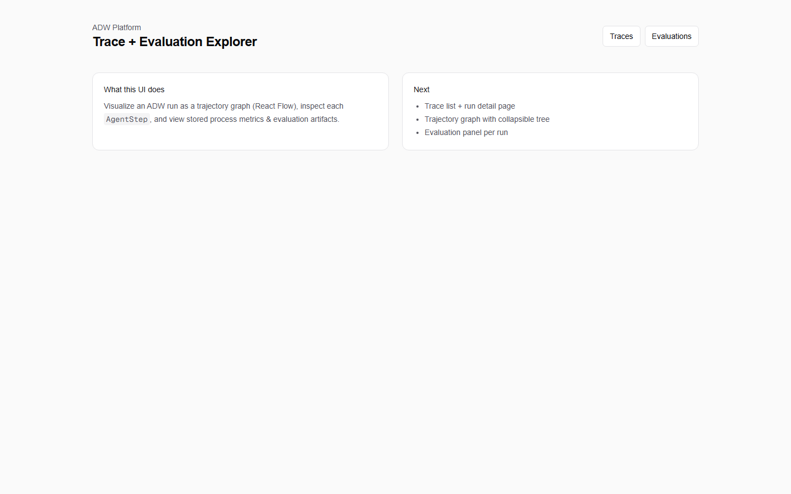
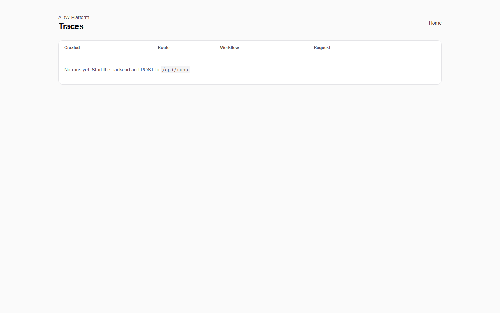
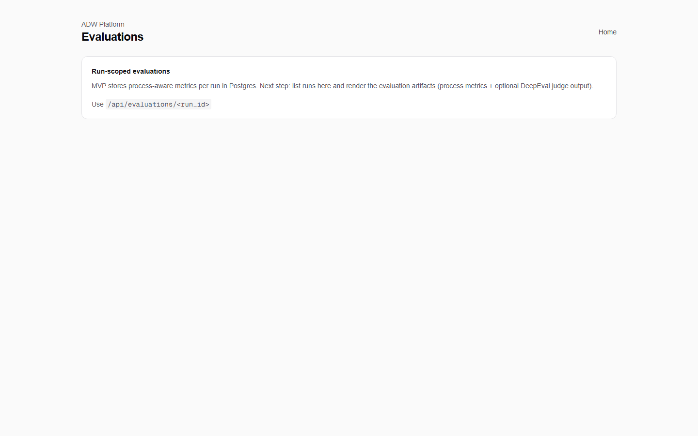

## Agentic RAG Evaluation Platform (MVP)

Developer-first evaluation + observability platform for **Agentic RAG workflows**: execution tracing, process-aware scoring, and trajectory visualization.

### Architecture


### Demo screenshots

Product demo:


Home:



Traces (list):



Evaluations:



### What’s in the MVP
- **Backend**: FastAPI + SQLAlchemy + Postgres + Redis (Celery-ready)
- **Adaptive routing**: **L0–L4** (no retrieval → dense → hybrid → agentic RAG → full ADW) with explicit budgets
- **Hybrid retrieval**: Postgres **FTS (sparse)** + **VectorStore** dense (**Qdrant** default, **Chroma** optional via `VECTOR_BACKEND=chroma`)
- **Knowledge Engine**: ingest pipeline (`chunk → sparse + dense → optional Neo4j entity graph`)
- **Graph augmentation**: Neo4j neighbor expansion on **L3/L4** when enabled
- **Agent orchestration**: LangGraph workflow + **step-level traces**
- **Evaluation**: process metrics + DeepEval scaffold
- **Frontend**: Next.js + trace graph + **retrieval timeline**, rerank delta, evaluations panel

### Repo layout
- `backend/app/knowledge_engine/`: ingestion / chunking / entity heuristics
- `backend/app/graph/`: Neo4j store + graph retrieval augmentation
- `backend/app/retrieval/`: VectorStore (Qdrant/Chroma), hybrid fusion, reranker
- `backend/app/router/`: adaptive L0–L4 classifier
- `frontend/`: Next.js UI (trace explorer + trajectory graph)
- `docker-compose.yml`: Postgres, Redis, Chroma, **Qdrant**, **Neo4j**

### Environment (common)
| Variable | Default | Purpose |
|----------|---------|---------|
| `VECTOR_BACKEND` | `qdrant` | `qdrant` or `chroma` for dense index |
| `QDRANT_URL` | `http://localhost:6333` | Qdrant HTTP |
| `QDRANT_COLLECTION` | `adw_chunks_v1` | collection name |
| `GRAPH_ENABLED` | `true` | set `false` to skip Neo4j |
| `NEO4J_URI` | `bolt://localhost:7687` | Graph DB |
| `NEO4J_USER` / `NEO4J_PASSWORD` | `neo4j` / `changeme_local_only` | must match `docker-compose` |

### Quickstart (Docker)
1. Start infra:

```bash
docker compose up -d
```

2. Backend (dev):

```bash
cd backend
python -m venv .venv
.\.venv\Scripts\activate
pip install -r requirements.txt
uvicorn app.main:app --reload --port 8000
```

3. Frontend (dev):

```bash
cd frontend
npm install
npm run dev
```

### URLs
- Backend API: `http://localhost:8000`
- OpenAPI docs: `http://localhost:8000/docs`
- Frontend: `http://localhost:3000`

